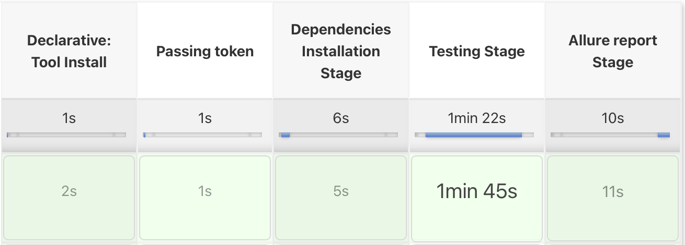

# TS-Cypress-BDD

### About
**Overview:** _TypeScript UI and API with BDD testing framework sample._

**Systems under test:**
- UI: Oracle login application.
- API: Gorest.co.in Rest and GraphQL application.

**Technology stack:**
- Basic: TypeScript, Cypress
- BDD: Cucumber
- UI: Cypress
- API: Cypress
- Reporting: Allure

## Locally on your machine
### Installation
1. Install [Node.js](https://nodejs.org/en/).
2. Install [Yarn](https://classic.yarnpkg.com/lang/en/docs/install)
3. Download the project.
4. Install dependencies with a terminal command `yarn install` or `npm install` in the project's root folder.
5. Get your token for [GoRest](https://gorest.co.in/my-account/access-tokens) (You need to register/login first).
6. In `projects_root_folder/cypress/fixtures` folder paste your token into `token.json` file as a value for the `token` key.
7. Additional step: You need to install [Allure](https://github.com/allure-framework/allure2), if you want to use it.

### Running tests
1. You can use Cypress GUI with `yarn cy:ui` command.
2. As well, you can start test suite with `yarn cy:headless` command.
3. Also, you can start the suite and generate Allure report with `yarn cy:allure` and after it, open it with `yarn allure:open`.
4. And the most prefered options is to use `yarn cy:allure:open` command, that would execute the suite, generate and open the report as an HTML doc.

### After test
- Framework creates allure reports, that located in `allure-results` folder.
- Check the `Running tests` section to get more info about working with Allure reports.
- **Note: Allure folder would be cleared within the next test run.**

## Jenkins CI
### Running tests
1. Install [Jenkins](https://www.jenkins.io).
2. Install default plugins in Jenkins.
3. As well there is a list of plugins that you need to install additionally via Jenkins > Manage Jenkins > Manage Plugins: Allure Jenkins Plugin, Git Plugin, GitHub Branch Source Plugin, GitHub plugin, HTML Publisher plugin, NodeJS Plugin, Pipeline, Pipeline: GitHub Groovy Libraries.
4. In Jenkins > Manage Jenkins > Global Tool Configuration click on `NodeJS installations...` button in `NodeJS` section and add name `node`, choose last version. Then apply and save.
5. Create a new Job with `Pipeline` type.
6. Job configuration:
- Enable `GitHub Project` checkbox and paste my project's git url
- Enable `This project is parameterised` checkbox and add a String parameter named `token`, it is important!
- Scroll down to the Pipeline section and choose `Pipeline script from SCM`, then choose Git as an option.
- Paste my project's url to the repo's url field: `https://github.com/artgrtmnk/TS-Cypress-BDD/` and specify the branch name a bit lower as: `*/main`.
- Apply and Save the pipeline.
7. Click on `Build with Parameters` in the left nav menu.
8. Paste your GoRest token into the token var field.
9. Click `Build` button

### After test
- Allure report would be generated automatically. The only thing you need to do is to click on `Allure Report` button in the left nav menu.
- **Note: Allure folder would be cleared within the next test run.**

## Post scriptum
**_Antipattern was used in this sample framework: Test scenarios from API feature files are running sequentially, just because that's a sample. Never do it in a real project. Each test scenario should be independent and all of the pre-conditions should be done within the Given steps!_**
